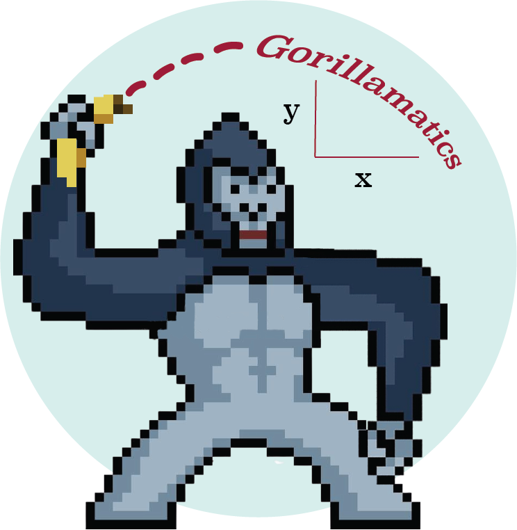

# Gorillamatics

Adam Belfki • Hadeel Farhan • Joshua Qin • Nivashini Suresh

An online multiplayer game designed to be used in classroom settings, in order to teach kinematics. Made for [HackHarvard 2022](https://devpost.com/software/gorilla-kinematics).

## How to run it

Clone or download the repository and click Server/Views/home.html

## Purpose

The goal of our project was to create an educational entertainment game that allows students to better engage in qualitative subjects. We wanted to provide a tool for instructors for both in-classroom and remote education and provide a way to make education more accessible for students attending remotely. Specifically, we focused on introductory high school physics, one of the most challenging subjects to tackle. Similar to Kahoot, teachers can setup a classroom or lobby for students to join in from their devices. Students can join in either as individuals, or as a team. Once a competition begins, students use virtual tape measures to find distances in their surroundings, determining how far their opponent is and the size of obstacles that they need to overcome. Based on these parameters, they can then try out an appropriate angle and calculate an initial velocity to fire their projectiles. Although there is no timer, students are incentivized to work quickly in order to fire off their projectiles before their opponents. Students have a limited number of shots as well, incentivizing them to double-check their work wisely.

